# Sistema de Gerenciamento de Leads
Este repositório contém a API e o Front-End para um sistema de gerenciamento de leads de uma empresa. O projeto é dividido em duas partes principais: um Back-End construído em Python usando Django e um Front-End utilizando JavaScript vanilla, HTML e CSS.

# Back-End
## Tecnologias Utilizadas
* Python 3.12
* Django
* Django REST Framework
* Django-Cors-Headers

## Descrição
A API do Back-End segue o padrão RESTful, implementado com o Django e armazena dados em um banco de dados SQLite pré-populado com dados fictícios para teste.

## Instalação e Configuração
1. Instale as dependências necessárias:  
```pip install django djangorestframework django-cors-headers```

2. Navegue até o diretório do Back-End:  
```cd Back-End/```

3. Inicie o servidor localmente:  
```python manage.py runserver```

# Front-End

## Descrição
O Front-End é uma interface de usuário web simples, construída sem o uso de frameworks adicionais, exceto pelo Bootstrap para controle de grid e responsividade.

## Tecnologias Utilizadas
* HTML
* CSS
* JavaScript Vanilla
* Bootstrap 5.3.2

## APIs conectadas
- LeadsAPI: Servidor fornecido junto da aplicação.
- [ViaCEP](https://viacep.com.br): Utilizada para realizar consultas de endereços a partir de CEPs brasileiros.

## Execução
Para visualizar o Front-End, abra o arquivo `Front-End/index.html` em um navegador web.

# Apresentação das funcionalidades da aplicação
Abaixo estão algumas capturas de tela da aplicação, destacando as diferentes funcionalidades e interfaces de usuário:

## Telas da Aplicação

Esta seção apresenta as várias interfaces do sistema de gerenciamento de leads, demonstrando a experiência do usuário em diferentes funcionalidades e dispositivos.

### Telas de Cadastro

A aplicação oferece uma interface única e simplificada. Na tela principal, todos os leads são apresentados de forma paginada, com uma barra de pesquisa para facilitar a filtragem. Funcionalidades para edição e criação de novos leads estão disponíveis, assim como um sistema de Dark Mode integrado para conforto visual.

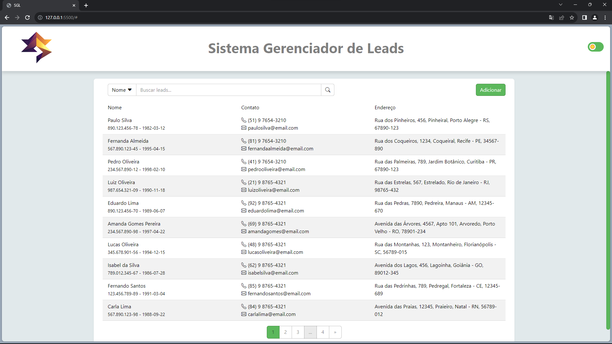

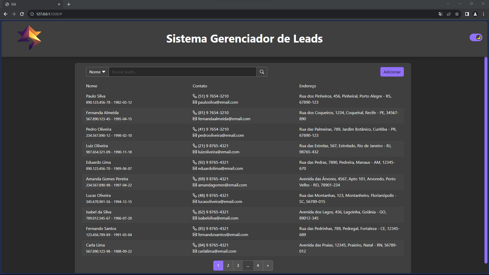

Ao selecionar a opção "cadastrar", um modal é exibido para o registro de um novo lead. A integridade dos dados é garantida por meio de validações em todos os campos, como a verificação de um CPF válido. Os outros campos têm validações básicas, como o tamanho máximo permitido. A aplicação também utiliza uma API externa para o preenchimento automático do endereço com base no CEP fornecido.

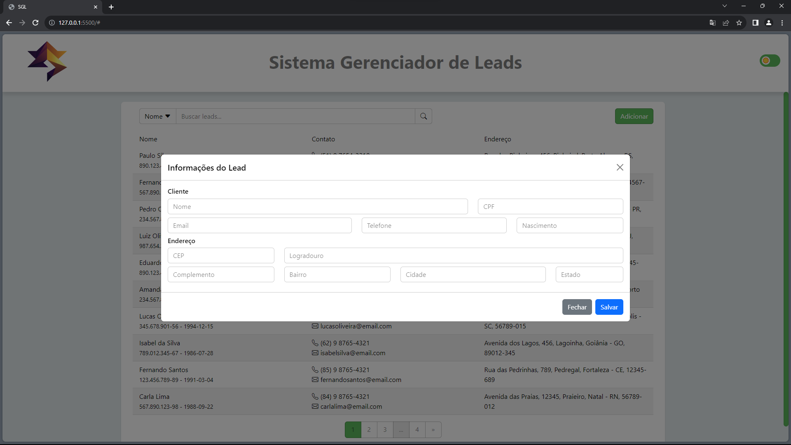

### Funcionalidades Avançadas do Formulário

Os formulários da aplicação são projetados para aprimorar a experiência do usuário por meio de funcionalidades intuitivas de auto-preenchimento e validação em tempo real:

- **Auto-completar com Símbolos:** Os campos numéricos, como o DDD do telefone e a pontuação do CPF, são automaticamente completados com símbolos necessários (parênteses, hífens, pontos etc.), permitindo uma entrada de dados rápida e formatada corretamente.

- **Preenchimento Automático do CEP:** Utilizando uma API externa, o sistema preenche automaticamente o endereço ao inserir um CEP válido, economizando tempo e reduzindo erros de entrada.

- **Validação em Tempo Real:** Ao digitar valores, a validação em tempo real alerta sobre quaisquer entradas inválidas, garantindo que todas as informações submetidas estejam corretas antes de prosseguir.

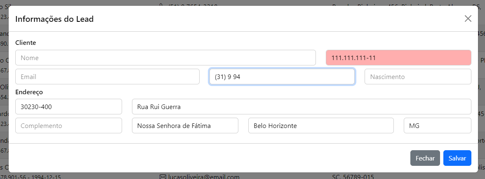


### Telas de Edição

Quando um lead é selecionado na lista, o modal é exibido preenchido com as informações existentes, e o campo CPF fica bloqueado por ser a chave primária do banco de dados e da API. Além da opção de salvar para editar as informações do lead, agora também é possível excluí-lo do banco de dados.

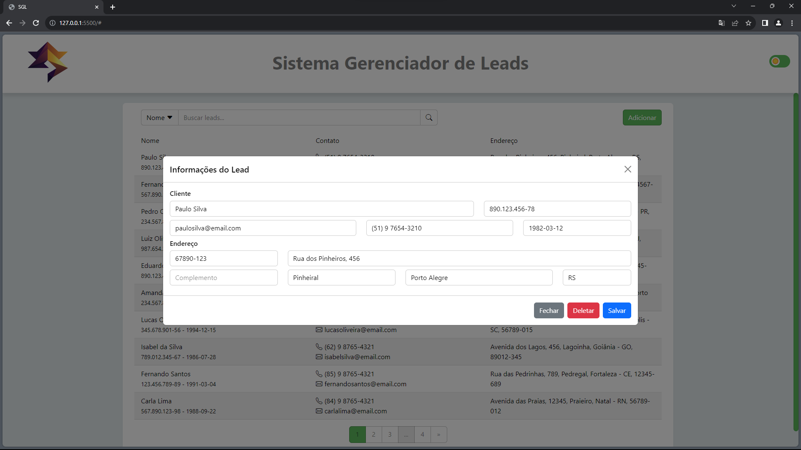

### Telas de Pesquisa

A funcionalidade de pesquisa permite filtrar os leads por qualquer atributo exibido. Após realizar uma busca, um botão é apresentado para retornar à visualização paginada com todos os leads.

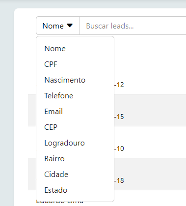

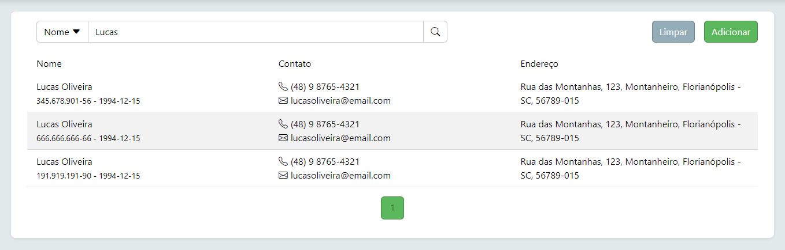

### Responsividade

Desenvolvida com a abordagem desktop-first, a aplicação é otimizada para a plataforma de uso principal, mas mantém responsividade em uma variedade de dispositivos e tamanhos de tela.

- Tela em um dispositivo móvel:  
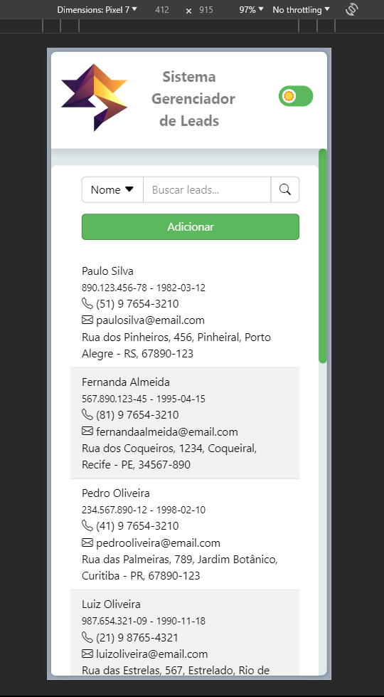

- Tela em um notebook:  
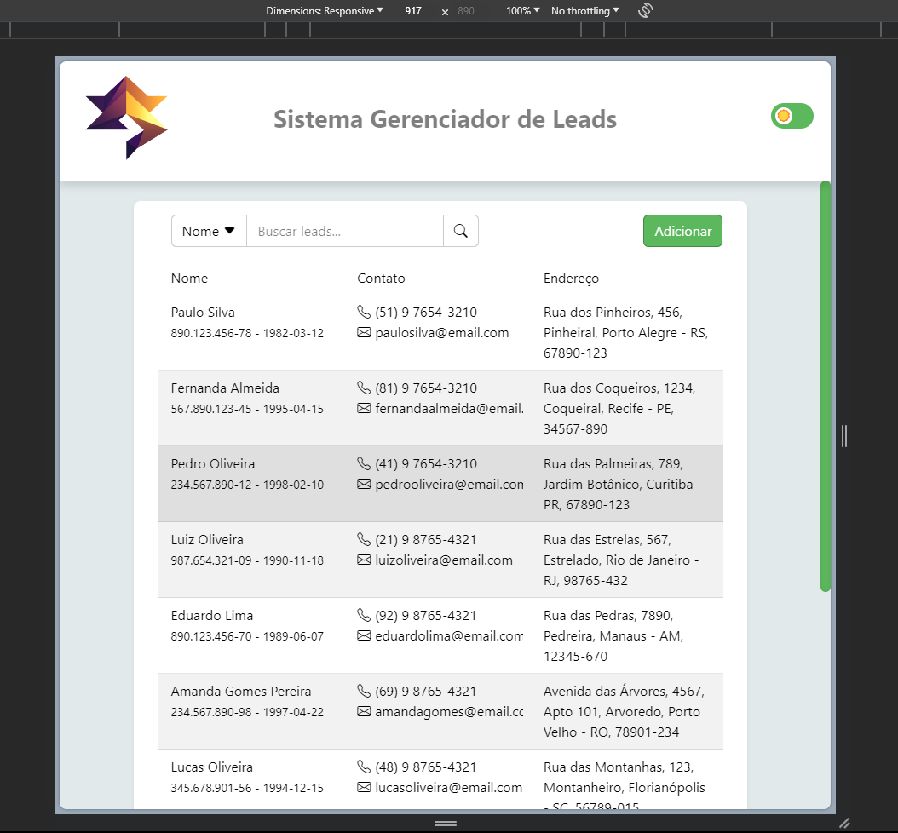

- Tela em um tablet:  
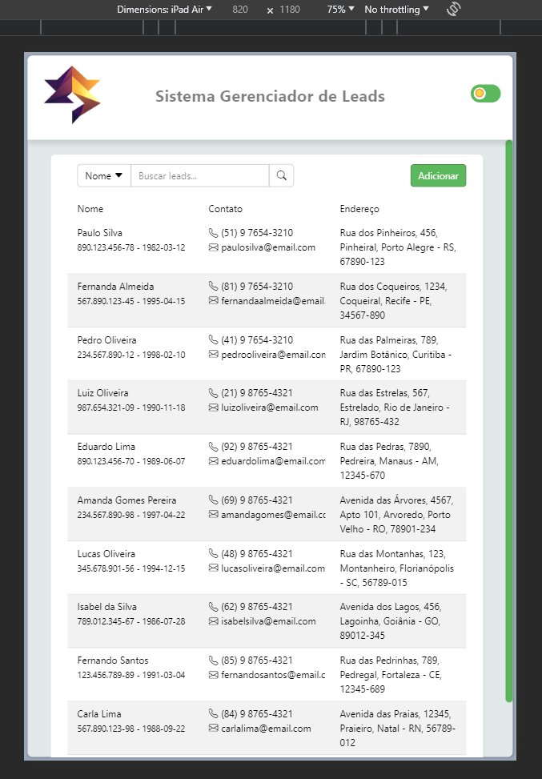

A responsividade é estendida aos formulários de cadastro de leads, assegurando uma experiência de usuário consistente em diferentes contextos.

- Formulário em tela larga:  
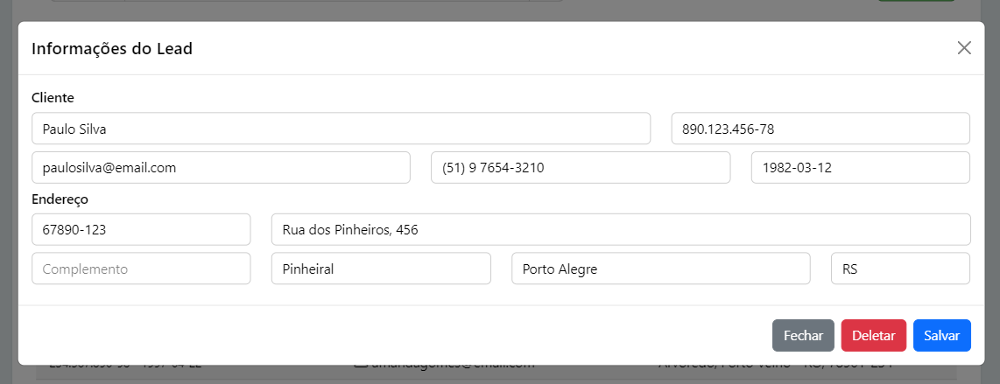

- Formulário em tablet:  
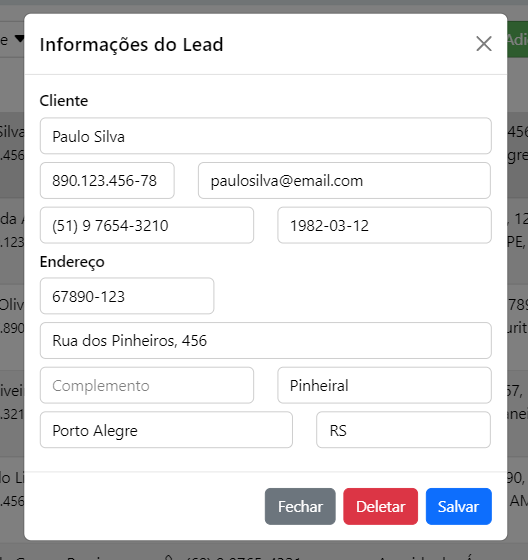

- Formulário em mobile:  
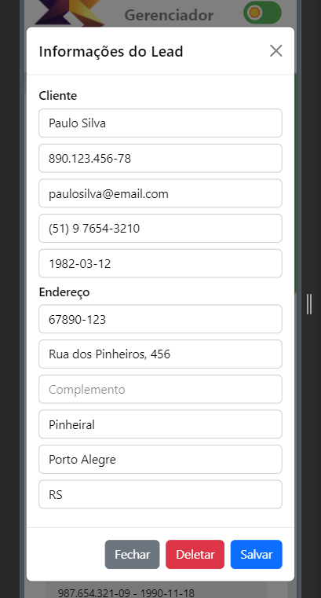

